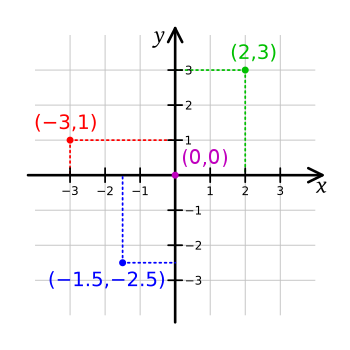
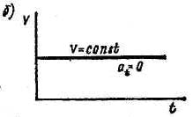

# _Динамика точки._
**_Динамика точки. Основные понятия и определения._**

В разделе кинематики исследовалось движение тел без учета причин, обеспечивающих это движение. Рассматривалось движение, заданное каким-либо способом и определялись траектории, скорости и ускорения точек этого тела..
В разделе динамики решается более сложная и важная задача. Определяется движение тела под действием сил приложенных к нему, с учетом внешних и внутренних условий, влияющих на это движение, включая самих материальных тел.

**Динамикой называется раздел механики, в котором изучаются законы движения материальных тел под действием сил.**

Понятие о силе, как о величине, характеризующей меру механи­ческого взаимодействия материальных тел, было введено в статике. Но при этом в статике мы, по существу, считали все силы постоян­ными. Между тем, на движущееся тело наряду с постоян­ными силами (постоянной, например, можно считать силу тяжести) действуют обычно силы переменные, модули и направления которых при движении тела изменяются.

**_Сила_** – векторная физическая величина, характеризующая действие одного тела на другое, в результате чего у тела изменяется скорость, то есть _появляется ускорение_, или происходит _деформация_ тела, либо имеет место и то, и другое. В том случае, когда тело при взаимодействии получает ускорение, говорят о _динамическом_ проявлении сил. В том случае, когда тело при взаимодействии деформируется, говорят о _статическом_ проявлении сил.  – векторная величина.

Как показывает опыт, переменные силы могут определенным об­разом зависеть **_от времени, от положения тела_ _и_ _от его скорости._** В частности, от времени зависит сила тяги электровоза при посте­пенном выключении или включении реостата; от положения тела зависит сила упругости пружины; от скорости движения зависят силы сопро­тивления среды (воды, воздуха).

К понятию об инертности тел мы приходим, сравнивая результаты действия одной и той же силы на разные материальные тела. Опыт показывает, что если одну и ту же силу приложить к двум разным, свободным от других воздействий покоящимся телам, то в общем случае по истечении одного и того же промежутка времени эти тела пройдут разные расстояния и будут иметь разные скорости.

**_Инертность_** и представляет собой **_свойство материальных тел быстрее или медленнее изменять скорость своего движения под действием приложенных сил._** Если, например, при действии одина­ковых сил изменение скорости первого тела происходит медленнее, чем второго, то говорят, что первое тело является более инертным, и наоборот.

**_Количественной мерой инертности данного тела является фи­зическая величина, называемая_** _**массой тела.**_ В механике масса _т_ рассматривается как величина скалярная, положительная и постоянная для каждого данного тела.

За единицу массы принят эталон – сплав платины и иридия, хранящийся в палате мер и весов в Париже: [_m_]=кг. Масса–величина аддитивная  и скалярная.

В общем случае движение тела зависит не только от его суммар­ной массы и приложенных сил; характер движения может еще зави­сеть от формы тела, точнее от взаимного расположения образующих его частиц (т.е. от распределения масс).

Чтобы при первоначальном изучении динамики иметь возможность отвлечься от учета влияния формы тел (распределения масс), вво­дится понятие о материальной точке.

Под **_материальной точкой_** понимают материальное тело столь малых размеров, что различием в движении отдельных его точек можно пренебречь и положение которого можно определить координатами одной из его точек.

Практически данное тело можно рассматривать как материальную точку в тех случаях, когда расстояния, проходимые точками тела при его движении, очень велики по сравнению с размерами самого тела. Кроме того, как будет показано в динамике системы _поступательно_ движущееся тело можно всегда рассматривать как материальную точку с массой, равной массе всего тела..

Наконец, материальными точками можно считать частицы, на кото­рые мы будем мысленно разбивать любое тело при определении тех или иных его динамических характеристик.

Точку будем называть _изолированной_, если на точку не оказывается никакого влияния, никакого действия со стороны других тел и среды, в которой точка движется. Конечно, трудно привести пример подобного состояния. Но представить такое можно.

При вращательном движении тела точки могут двигаться неодинаково, в этом случае некоторые положения динамики можно применять только к отдельным точкам, а материальный объект рассматривать как совокупность материальных точек.

Поэтому при изучении динамики выделяют два основных раздела: "Динамика материальной точки" и "Динамика материальной системы", из которых первый предваряет второй.

Время в классической механике не связано с пространством и движением материальных объектов. Во всех системах отсчета движущихся друг относительно друга оно протекает одинаково.

 **_Законы динамики_**

В основе динамики лежат законы, установленные путем обобщения результатов целого ряда опытов и наблюдений над движением тел и проверенные обширной общественно-исторической практикой человечества. Систематически эти законы были впервые изложены И. Ньютоном. 

**Первый закон (закон инерции)**, открытый Галилеем, гласит: **_существуют такие системы отсчета, относительно которых тело покоится или движется прямолинейно и равномерно, если на него не действуют другие тела или действие этих тел компенсировано._**

или в другой формулировке

**_если сумма действующих на тело сил равна нулю, то тело движется равномерно и прямолинейно или находится в покое._**

Движение, совершаемое точ­кой при отсутствии сил, называется движением **_по инерции._**

Закон инерции отражает одно из основных свойств материи - пребывать неизменно в движении и устанавливает для материальных тел эквивалентность состояний покоя и движения по инерции. Из него следует, что если _F_=0, то точка покоится или движется с постоян­ной по модулю и направлению скоростью  ( =const); ускорение точки при этом равно нулю:  = 0); если же движение точки не является равномерным и прямолинейным, то на точку действует сила.

Система отсчета, по отношению к которой выполняется закон инерции, называется **_инерциальной системой отсчета_** (иногда ее условно называют неподвижной). По данным опыта для нашей Сол­нечной системы инерциальной является система отсчета, начало кото­рой находится в центре Солнца, а оси направлены на так называемые неподвижные звезды. При решении большинства технических задач инерциальной, с достаточной для практики точностью, можно считать систему отсчета, жестко связанную с Землей.

Системы отсчета, в которых не выполняется первый закон Ньютона, называются **неинерциальными**. Неинерциальными будут системы, движущиеся с ускорением, или вращающиеся.

**Второй закон (основной закон динамики)**  гласит: _**произведение массы точки на ускорение, которое она получает под действием данной силы, равно по модулю этой силе, а направление ускорения совпадает с направлением силы (рис.1).**_

Математически этот закон выражается векторным равенством _._

      

Второй закон динамики, как и первый, имеет место только по отношению к инерциальной системе отсчета. Из этого закона непо­средственно видно, что мерой инертности материальной точки является ее масса, так как две разные точки при действии одной и той же силы получают одинаковые ускорения только тогда, когда будут равны их массы; если же массы будут разные, то точка, масса кото­рой больше (т. е. более инертная), получит меньшее ускорение, и наоборот.

Известно, что вес тела и ускорение его свободного падения пустоте существенно зависят от места земной поверхности. В данной точке земли ускорение свободного падения всех тел одинаково и обозначается буквой g. Экспериментально установлено, что отношение веса Р тела к ускорению его свободного падения g есть постоянная величина, не зависящая от места наблюдения. Это отношение m = P/g также определяет массу тела. Таким образом, различают тяжелую массу m1 = P/g и инертную массу m2 = F/a. В классической механике считается, что m1=m2=m.

Если на точку действует одновременно несколько сил, то они, как известно, будут эквивалентны одной силе, т.е. равнодействую­щей **_,_** равной геометрической сумме этих сил. Уравнение, выражаю­щее основной закон динамики, принимает в этом случае вид

 или .

Существует и более общая формулировка второго закона Ньютона: скорость изменения импульса материальной точки равно действующей на нее силе: . Данное выражение называется уравнением движения материальной точки.

В общем случае сила, действующая на тело, изменяется со временем и по величине, и по направлению. Но в течение элементарного промежутка времени _dt_ мы можем считать, что =const. Векторная величина , равная , называется **_элементарным импульсом (силы)._**

Второй закон Ньютона в дифференциальной форме:

в проекциях на оси:

Из второго закона также получим размерность силы: 1Н=1 кг∙1 м/с2.

**Третий закон (закон равенства действия и противодействия)** устанавливает характер механического взаимодействия между мате­риальными телами. Для двух материальных точек он гласит: **_две ма­териальные точки действуют друг на друга с силами, равными по модулю и направленными вдоль прямой, соединяющей эти точки, в противоположные стороны (рис.2)._**

Заметим, что силы взаимодействия между свободными материаль­ными точками (или телами), как приложенные к разным объектам, не образуют уравновешенной системы.

Проведём небольшой эксперимент. Попробуем перемещать тяжёлое тело по некоторой криволинейной траектории. Сразу обнаружим, что тело сопротивляется изменению направления движения, изменению скорости. Возникает сила со стороны тела, противодействующая силе , той, которую мы прикладываем к нему.

Эту силу, с которой материальная точка сопротивляется изменению своего движения, будем называть **_силой инерции_** этой точки - . По третьему закону она равна и противоположна действующей на точку силе, . Но на основании второй аксиомы . Поэтому .

Итак, сила инерции материальной точки по величине равна произведению её массы на ускорение

Fин=m_a_.

И направлена эта сила инерции в сторону противоположную вектору ускорения.

Например, при движении точки по кривой линии ускорение . Поэтому сила инерции

.

То есть её можно находить как сумму двух сил: нормальной силы инерции и касательной силы инерции.

Причём

Необходимо заметить, что сила инерции материальной точки, как сила противодействия, приложена не к точке, а к тому телу, которое изменяет её движение. Это очень важно помнить.

Третий закон динамики, как устанавливающий характер взаимодей­ствия материальных частиц, играет большую роль в динамике системы.

**Четвертый закон (закон независимого действия сил).** При одновременном действии на материальную точку нескольких сил ускорение точки относительно инерционной системы отсчета от действия каждой отдельной силы не зависит от наличия  других, приложенных к точке, сил и полное ускорение равно векторной сумме ускорений от действия отдельных сил.

Законы Ньютона в классической механике **_применимы_** для описания движения: а) макротел; б) для тел постоянной массы; в) при скоростях, значительно меньших скорости света.
