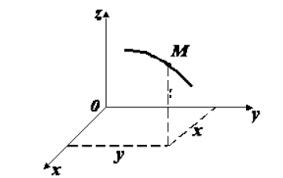

# Кинематика точки и твердого тела
### Краткие сведения по истории развития кинематики

Кинематика, как специальный раздел теоретической механики, возникла позднее статики и динамики, а именно, в начале второй половины XIX в. Появление первых исследований по кинематике связано с изобретением огнестрельного оружия. В первую очередь внимание исследователей привлекали вопросы определения траекто­рии полета снаряда, уточнение понятий о неравномерном и криво­линейном движении точки. Леонардо да Винчи (1452—1519) первый экспериментально изучал вопрос о свободном вертикальном паде­нии тяжелого тела. Однако лишь благодаря трудам Г. Галилея (1564—1642) развитие механики тесно связывается с запросами техники того времени. Галилею принадлежит введение понятия об ускорении и доказательство того, что траекторией движения снаряда, брошенного в пустоте под некоторым углом к горизонту, является парабола. Законы, найденные Галилеем, были развиты в исследова­ниях Э. Торричелли (1608—1647), установившем формулу пропорцио­нальности скорости падения тела корню квадратному из высоты падения. Обобщение понятия ускорения на случай криволинейного движения было получено X. Гюйгенсом (1629—1695), который первым обратил внимание на возможность разложения ускорения при криволинейном движении на касательное и нормальное. Однако строгое доказательство этого было дано Л. Эйлером (1707—1783).

Кинематические законы движения планет были установлены И. Кеплером (1571—1630). Эти законы легли в основу закона все­мирного тяготения, открытого Ньютоном.

Л. Эйлеру принадлежат основополагающие исследования по ки­нематике точки в случае естественного способа задания движения, по кинематике вращательного движения твердого тела вокруг непо­движной точки. Он создал широко применяемый метод кинематиче­ского описания движения твердого тела с помощью трех углов, назы­ваемых углами Эйлера.

Развитие кинематики системы обязано трудам Ж. Лагранжа (1736-1813).

Однако только бурный рост машиностроения в XIX в. повлек за собой расцвет кинематики как науки. По предложению Ж. Ампе­ра в 1851 г. кинематика выделилась в особый раздел теоретической механики. Появляется ряд глубоких исследований по кинематике твердого тела французских ученых М. Шаля (1793—1886), Л. Пуансо, Г. Кориолиса (1792—1843). П. Л. Чебышев (1821—1894) создал в России научную школу по кинематике механизмов. Богатое науч­ное наследие по кинематике механизмов Чебышева разрабатывается советскими учеными, среди которых, в первую очередь, следует отметить Н. И. Мерцалова (1860—1948), И. И. Артоболевского, А. П. Котельникова (1865—1940), Д. С. Зернова, Л. В. Асура (1878—1920), Я. Л. Геронимуса и др.

 «Отцу русской авиации» Н. Е. Жуковскому (1847—1921) принад­лежат первоклассные работы по теоретической механике, в том числе и по кинематике, в которых широко внедрены геометрические методы доказательств различных теорем. Ряд замечательных иссле­дований по кинематике принадлежит профессору Одесского уни­верситета В. Н. Лигнину (1846—1900), возглавлявшему на Украине научное направление исследований по кинематике.

**_Кинематика точки. Введение в кинематику._**

**Кинематикой** (от греческого «кинема» — движение) называется раздел механики, в котором изучаются геометрические свойства движения тел без учета их инертности (массы) и действующих на них сил.

 В кинематике изучают зависимости между пространственно-временными характеристиками механического движения. Поэтому кинематику называют также геометрией движения.

Основной задачей кинематики является нахождение положения тела в любой момент времени, если известны его положение, скорость и ускорение в начальный момент времени.

 Обычно кинематику подразделяют на две части — кинематику точки и кинематику твердого тела.

**Механическое движение** - это изменение положения тел (или частей тела) относительно друг друга в пространстве с течением времени.

Для определения положения движущегося тела (или точки) в разные моменты времени с телом, по отношению к которому изучается движение, жестко связывают какую-нибудь систему координат, образующую вместе с этим телом систему отсчета.

**Тело отсчета** - тело (или группа тел), принимаемое в данном случае за неподвижное, относительно которого рассматривается движение других тел.

**Система отсчета** - это система координат, связанная с телом отсчета, и выбранный способ измерения времени.

Изображать систему отсчета будем в виде трех координатных осей (не показывая тело, с которым они связаны).

Движение тел совершается в пространстве с течением времени. Пространство в механике мы рассматриваем, как трехмерное евклидово пространство.

Время является скалярной, непрерывно изменяющейся величиной. В задачах кинематики время t принимают за независимое переменное (аргумент). Все другие переменные величины (расстояния, скорости и т. д.) рассматриваются как изменяющиеся с течением времени, т.е. как функции времени t.

В теоретической механике при измерении пространства за основ­ную единицу длины принимают метр (м), а за основную единицу времени — секунду (с). Время предполагается одинаковым в любых системах отсчета (системах координат) и не зависимым от движения этих систем относительно друг друга. Время обозначается буквой и рассматривается как непрерывно изменяющаяся величина, прини­маемая в качестве аргумента.

 При измерении времени в кинематике различают такие понятия, как промежуток времени, момент времени, начальный момент вре­мени.

 Промежутком времени называется время, протекающее между двумя физическими явлениями. Моментом времени называют границу между двумя смежными промежутками времени. Начальным момен­том называется время, с которого начинают отсчет времени.

Для решения задач кинематики надо, чтобы изучаемое движение было как-то задано (описано).

Кинематически задать движение или закон движения тела (точки) - значит задать положение этого тела (точки) относительно  данной системы отсчета в любой момент времени.

Основная задача кинематики точки и твердого тела состоит в том, чтобы, зная закон движения точки (тела), установить методы определения всех кинематических величин, характеризующих дан­ное движение.

Положение тела можно определить с помощью радиус-вектора или с помощью координат.

**Радиус-вектор** точки М - направленный отрезок прямой, соединяющий начало отсчета О с точкой М.

**Координата х точки М** - это проекция конца радиуса-вектора точки М на ось Ох. Обычно пользуются прямоугольной системой координат Декарта. В этом случае положение точки М на линии, плоскости и в пространстве определяют соответственно одним (х), двумя (х, у) и тремя (х, у, z) числами - координатами.

**Материальная точка** - тело, размерами которого в данных условиях можно пренебречь.

Этой моделью пользуются в тех случаях, когда линейные размеры рассматриваемых тел много меньше всех прочих расстояний в данной задаче или когда тело движется поступательно.

 Основной задачей кинематики точки является изучение законов движения точки. Зависимость между произвольными положениями движущейся точки в пространстве и времени определяет закон ее движения. Закон движения точки считают известным, если можно определить положение точки в пространстве в произвольный момент времени. Положение точки рассматривается по отношению к вы­бранной системе координат.

**Поступательным называется движение тела**, при котором прямая, проходящая через любые две точки тела, перемещается, оставаясь параллельной самой себе. При поступательном движе­нии все точки тела описывают одинаковые траектории и в любой момент времени имеют одинаковые скорости и ускорения. Поэтому для описания такого движения тела достаточно описать движение его одной произвольной точки.

В дальнейшем под словом "тело" будем понимать "материальная точка".

Линия, которую описывает движущееся тело в определенной системе отсчета, называется **траекторией**. На практике форму траектории задают с помощью математических формул ($ у=f(х) $ — уравнение траектории) или изображают на рисунке. Вид траектории зависит от выбора системы отсчета. Например, траекторией тела, свободно падающего в вагоне, который движется равномерно и прямолинейно, является прямая вертикальная линия в системе отсчета, связанной с вагоном, и парабола в системе отсчета, связанной с Землей.

В зависимости от вида траектории различают прямолинейное и криволинейное движение.

**Путь s** - скалярная физическая величина, определяемая длиной траектории, описанной телом за некоторый промежуток времени. Путь всегда положителен: s> 0.

**Перемещение** $ x= x'+x_0 $ тела за определенный промежуток времени - направленный отрезок прямой, соединяющий начальное (точка М0) и конечное (точка М) положение тела:

 $$ y_{c}= \sum m_iy_i/\sum m_i $$ 

Проекция перемещения на ось $ Ох: ∆rx =∆х = х-х0 $, где $ x0 $ и $ x $ - координаты тела в начальный и конечный моменты времени.

*Модуль перемещения не может быть больше пути.*

Знак равенства относится к случаю прямолинейного движения, если направление движения не изменяется.

Зная перемещение и начальное положение тела, можно найти его положение в момент времени t.
**Способы задания движения точки**

Для задания движения точки можно применять один из следую­щих трех способов:

1) векторный,
2) координатный,
3) естественный.

**1. Векторный способ задания движения точки.**

Пусть точка М движется по отношению к некоторой си­стеме отсчета $ Oxyz $. Положение этой точки в любой момент времени можно определить, задав ее радиус-вектор, проведенный из на­чала координат О в точку М
При движении точки М вектор будет с течением времени изме­няться и по модулю, и по направлению. Следовательно, является переменным вектором (вектором-функцией), зависящим от аргу­мента.

Равенство определяет закон движения точки в векторной форме, так как оно позволяет в любой момент времени построить соответствующий вектор и найти положение движущейся точки.

Геометрическое место концов вектора, т.е. **_годограф_** этого вектора, определяет траекторию движущейся точки.

**2. Координатный способ задания движе­ния точки.**

Положение точки можно непосредственно опре­делять ее декартовыми координатами х, у, z , которые при движении точки будут с течением времени изменяться. Чтобы знать закон дви­жения точки, т.е. ее положение в пространстве в любой момент вре­мени, надо знать значения координат точки для каждого момента времени, т.е. знать зависимости

$x=f1(t),      y=f2(t),     z=f3(t)$.

Уравнения представляют собой уравнения движения точки в прямоугольных декартовых координатах. Они определяют закон движения точки при координатном способе задания движения.

Чтобы получить уравнение траектории надо из уравнений движения исключить параметр t.

Нетрудно установить зависимость между векторным и координатным способами задания движения.

Разложим вектор $Δs=\sqrt{Δs_x^2+Δs_y^2+Δs_z^2}$ на составляющие по осям координат:

$Δs_x = Δscosα$

где $rx, ry, rz$ - проекции вектора на оси;

Так как начало вектора находится в начале координат, то проекции вектора будут равны координатам точки _M_. Поэтому если движение точки задано в полярных координатах
r=r(t),    φ = φ(t),
 где r — полярный радиус, φ — угол между полярной осью и по­лярным радиусом, то данные уравнения выражают уравнение траекто­рии точки. Исключив параметр t, получим
 r = r(φ).

