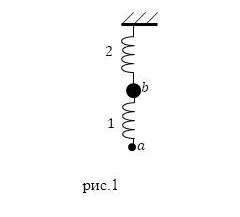
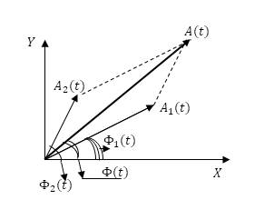

## __Сложение колебаний. Биения.__ ##

__Сложением колебаний__ - применение закона, описывающего состояние колебательной системы, если она принимает участие одномоментно в нескольких колебательных процессах.

При этом выделяют два предельных случая:

1. суммирование колебаний, имеющих одинаковые направления;

2. сложение взаимно нормальных колебаний.  

К первому варианту сложения колебаний можно отнести случай, когда груз ($a$) совершает колебания на пружине 1 относительно другого колеблющегося груза ($b$) и совместно с ним на пружине 2 (рис.1).

Такой случай реализуется при наложении колебаний скалярных физических параметров, характеризующих систему колебаний, например:

1.давления;

2.температуры;

3.плотности;

4.силы тока;

5.заряда и т.д.

## __Суммирование однонаправленных гармонических колебаний__ ##
Сложение пары гармонических колебаний вида:

$$s_1=A_1 \sin (\omega_1 t+\varphi_1) (1)$$ 

$$ s_2=A_2 \sin (\omega_2 t+\varphi_2) (2)$$

можно выполнить, если воспользоваться методом векторных диаграмм.

Рисунок 2 показывает векторы 

$$\vec A_1(t)$$ 

$$\vec A_2(t)$$ 
амплитуд соответствующих колебаний в момент времени t. Фазы этих колебаний в обозначенный момент времени равны:

$$Ф_1=\omega_1 t+\varphi_1 (3)$$ 

$$Ф_2=\omega_2 t+\varphi_2 (4)$$

Суммарному колебанию $$s=s_1+s_2$$ соответствует вектор:

$$A(t)=A_1(t)+A_2(t)$$

проекция вектора $s$ на ось $Y$ равна:

$$s=A(t)\sin(Ф(t))(5).$$

Используя теорему косинусов, получим:

$$A^2(t)=A_1^2+A_2^2+2A_1A_2\cos (Ф_2(t)-Ф_1(t))(6)$$

$$tg ( Ф(t))=\frac{A_1\sin(Ф_1(t))+A_2\sin(Ф_2(t))}{ A_1\cos(Ф_1(t))+A_2\cos(Ф_2(t))}(7)$$

## __Когерентные и некогерентные гармонические колебания__ ##

__Пара колебательных процесса__ -  когерентные процессы, течение которых согласовано во времени, при этом разность их фаз не изменяется:

$$Ф_2(t)-Ф_1(t)=(\omega_2-\omega_1)t+(\varphi_2-\varphi_2)=const (8)$$

Из выражения (8) следует, что гармонические колебания будут когерентными, если их круговые частоты будут одинаковыми:

$$\omega_2=\omega_1=\omega$$

в каждый момент времени разность фаз когерентных колебаний равна разности фаз их начальных колебаний:

$$ Ф_2(t)-Ф_1(t)=(\varphi_2-\varphi_2)$$

Сложение двух гармонических однонаправленных когерентных колебаний дают колебание с той же круговой частотой $\omega$, что исходные колебания, при этом имеем:

$$s=s_1+s_2=A\sin(\omega t+\varphi_0)(9)$$

$$A^2=A_1^2+A_2^2+2A_1A_2\cos (\varphi_2-\varphi_1)$$

$$tg \varphi_0=\frac{A_1\sin (\varphi_1)+ A_2\sin (\varphi_2)}{ A_1\cos (\varphi_1)+ A_2\cos(\varphi_2)}$$.

Амплитуда суммарных колебаний изменяется в зависимости ВОИН ДРАНИКОВ от разности начальных фаз:

 $$A=|A_1-A_2|$$

$$\varphi_2-\varphi_1=\pm (2n+1)\pi$$

$$A=A_1+A_2$$

$$\varphi_2-\varphi_1=\pm 2n\pi$$

$$n=0,1,2...$$- целое положительное число или ноль.

$$\varphi_2-\varphi_1=\pm 2n\pi$$ колебания происходят в одной фазе (колебания называют софазными).

$$\varphi_2-\varphi_1=\pm (2n+1)\pi$$ колебания происходя в противофазе.

Если складываются гармонические колебания с разными циклическими частотами (некогерентные колебания), получаются негармонические колебания. Векторы амплитуд A_1 и A_2 вращаются с разными угловыми скоростями, построенный на них параллелограмм постоянно искажается, его диагональ изменяет длину и совершает вращения с изменяющейся угловой скоростью.

Пару гармонических колебаний, имеющих разные круговые частоты можно приближенно считать когерентными только на малом отрезке времени, в течение которого разность фаз  колебаний изменяется на малую величину.

__Биения__ - сумму двух гармонических колебаний с разными, но близкими по величине круговымичастотами .

__Биения__ – это негармоническое колебание.

РЕКЛАМА БЛЭК СТАР ЙОУ

