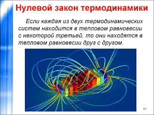
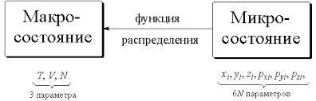

#  Основные понятия и исходные положения термодинамики.
**Макроскопические системы и параметры. – Состояние термодинамического равновесия. – Интенсивные и экстенсивные параметры. – Энергия и энтропия. – Пространство состояний термодинамической системы. – Фундаментальное соотношение**

Та часть Вселенной, которую мы собираемся изучать, называется (физической) системой, а все остальное – ее окружением. Термодинамика занимается изучением некоторых общих закономерностей, присущих макроскопическим системам, т. е. системам с очень большим или бесконечным числом механических степеней свободы.

Все материальные тела, чьи размеры намного превышают размеры отдельных атомов и молекул, могут рассматриваться как макроскопические системы. Электромагнитное поле в некоторой области пространства доставляет пример макроскопической системы с бесконечным числом степеней свободы. Системы с малым числом степеней свободы в термодинамике не рассматриваются. Все макроскопические признаки, характеризующие макроскопическую систему, называются макроскопическими параметрами. К их числу относятся, например, такие физические величины, как внутренняя энергия, объем, давление, температура, концентрация, упругость, намагниченность и т. д.
В отличие от микроскопических, макроскопические параметры характеризуют макроскопическую систему в целом, а не задаются свойствами ее отдельных (микроскопических) частей. Например, давление и объем газа в сосуде являются макроскопическими параметрами газа, а координаты и скорости отдельной молекулы – нет. 

***Макроскопическая система*** называется замкнутой, если она не взаимодействует с окружением; в противном случае система называется открытой. Понятие замкнутой системы является, конечно же, идеализацией – все реальные физические системы в той или иной степени взаимодействуют с окружением. Единственной реально замкнутой физической системой можно считать лишь Вселенную в целом.

Говорят, что макроскопическая система находится в состоянии термодинамического равновесия, если все ее макроскопические параметры хорошо определены и не меняются со временем. В термодинамике постулируется, что с течением времени всякая замкнутая макроскопическая система самопроизвольно переходит в состояние термодинамического равновесия, которое уже никогда не покидает. 
Это утверждение, являющееся обобщением большого эмпирического опыта, принимается в качестве первого постулата термодинамики. Переход макроскопической системы в состояние равновесия называется релаксацией, а промежуток времени, за который этот переход осуществляется, – временем релаксации. Заметим, что первый постулат ничего не говорит ни о времени релаксации, ни о деталях самого физического процесса перехода к состоянию равновесия. Для различных систем время релаксации может меняться в очень широких пределах: от $10^{16}$ c для установления равновесного давления в газе до нескольких лет при выравнивании концентрации веществ в твердых растворах. Термодинамической системой называется макроскопическая система, находящаяся в состоянии термодинамического равновесия. Соответственно, термодинамическими параметрами называются макроскопические параметры, характеризующие макроскопическую систему в ее термодинамическом равновесии.
Согласно первому постулату термодинамики эти параметры хорошо определены и не меняются со временем.

Все термодинамические параметры можно условно разделить на две группы – интенсивные и экстенсивные. Это разделение определяется поведением параметров при (мысленном или реальном) разбиении системы на (макроскопические) подсистемы. Значение интенсивных параметров оказывается одинаковым для каждой из подсистем, в то время как экстенсивные параметры ведут себя аддитивно – значение любого экстенсивного параметра системы есть сумма его значений для каждой из подсистем. Примерами интенсивных параметров являются давление, концентрация, температура, намагниченность и т. д. Объем, число частиц, внутренняя энергия, энтропия дают примеры экстенсивных термодинамических параметров.

  
