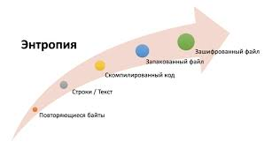

	*Уравнения состояния. – Температура и давление. – Соотношения Максвелла. – Термодинамические связи. – Основная задача термодинамики. – Принцип максимума энтропии. – Тепловое равновесие.*
Как отмечалось выше, фундаментальное соотношение несет в себе исчерпывающую информацию о свойствах термодинамической системы. В частности, оно позволяет определить значение интенсивных параметров в состоянии термодинамического равновесия. В термодинамике постулируется, и мы примем это в качестве четвертого постулата, что все функционально независимые экстенсивные параметры, характеризующие заданную термодинамическую систему, могут быть получены как частные производные удельной энтропийной (или энергетической) функции:
$Pi = ∂s ∂xi , i = 1, 2, . . . , n − 1$ .
Следовательно, число независимых экстенсивных параметров на единицу меньше числа степеней свободы термодинамической системы. Вычисляя частные производные удельной энергетической функции $u(x 1 , . . . , xn−1 ) = U(x 1 , . . . , xn−1 , 1)$ получим еще один набор экстенсивных параметров: 
$P 0 i = ∂u ∂xi , i = 1, 2, . . . , n − 1$
Эти новые параметры, однако, не будут независимыми от старых. Действительно, исключая из совместной системы уравнений  и переменные $x^i$  можно выразить остающиеся переменные $Pi$ как функции $Pj$ и наоборот Возможность такого перевыражения накладывает, конечно, некоторые дополнительные ограничения на функции удельной энергии и энтропии. Упоминавшаяся в предыдущей лекции теорема об обратной функции требует, например, чтобы матрицы вторых частных производных 
$ ∂2s / ∂xi∂xj)$
были невырождены. В термодинамике обычно накладывается более сильное условие, требующее, чтобы все собственные значения первой матрицы были бы строго отрицательны, а второй – строго положительны во всей допустимой области изменения термодинамических параметров.
Основная задача термодинамики состоит в нахождении равновесных состояний для заданной термодинамической системы со связями. Каким же образом классическая термодинамика решает эту задачу? Выше мы постулировали, что в S-представлении вся информация о термодинамической системе заключена в ее энтропийной функции. Следовательно, эта функция должна «знать» все и о равновесных состояниях термодинамической системы, подчиненной тем или иным термодинамическим связям. Простейшее и наиболее естественное предположение о связи энтропии с состоянием равновесия, подтверждающееся опытом, формулируется следующим образом.

***В состоянии термодинамического равновесия энтропия замкнутой термодинамической системы со связями достигает своего максимального значения.***
Это утверждение, известное как принцип максимума энтропии, мы примем в качестве пятого постулата термодинамики. Отметим очевидную аналогию с принципом наименьшего действия в классической механике. Как известно, в лагранжевом формализме вся информация о механической системе кодируется функционалом действия на пространстве траекторий системы. Основная задача классической механики состоит в нахождении истинных траекторий движения при заданных начальном и конечном положениях системы. Принцип наименьшего действия утверждает, что истинные траектории системы соответствуют минимуму функционала действия в классе траекторий, подчиненных данным граничным условиям. В отличие от классической механики, где для вывода уравнений Эйлера – Лагранжа приходится привлекать аппарат вариационного исчисления, нахождение максимума энтропии сводится к классической задаче математического анализа на условный экстремум функции.