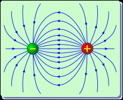
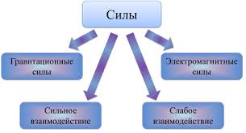
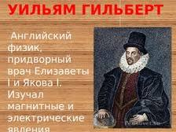
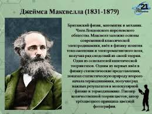

В настоящее время в природе известны четыре типа **фундаментальных взаимодействий** - сильное, электромагнитное, слабое и гравитационное. Сильное взаимодействие обеспечивает притяжение частиц, образующих ядра атомов (нуклонов). Электромагнитное взаимодействие обеспечивает притяжение или отталкивание частиц, обладающих специальным свойством - зарядом. Электромагнитное взаимодействие приблизительно на два порядка слабее сильного. Слабое взаимодействие, интенсивность которого приблизительно на 16 порядков слабее сильного, ответственно за распад "элементарных" частиц. 

Наконец, гравитационное взаимодействие, которое на 43-44 порядка слабее сильного, ответственно за притяжение частиц, обладающих массами. Первым из четырех перечисленных было открыто гравитационное взаимодействие. Следующим было электромагнитное взаимодействие, которое определяет колоссальное количество явлений природы. Электромагнитное взаимодействие характеризуется участием так называемого электромагнитного поля. 

**Электромагнитное поле** - особая форма материи, посредством которой осуществляется взаимодействие между заряженными частицами. 

**Электродинамика** - физическая теория определяющая свойства электромагнитного поля. 

Начиная с середины XX века, электродинамика делится на классическую и квантовую. Законы классической электродинамики сформулированы в середине XIX века в уравнениях Максвелла. Система уравнений Максвелла позволяет определить значения основных характеристик электромагнитного поля - вектор напряженности электрического поля E и вектор магнитной индукции поля B в зависимости от распределения в пространстве зарядов и токов. Как показали исследования электромагнитных взаимодействий, законы классической электродинамики оказались неприменимы для процессов, протекающих на малых пространственно - временных интервалах. В этом случае справедливы законы так называемой квантовой электродинамики.

Первые исследования электромагнитных явлений сформировали два независимых раздела, определяющих свойства электрических явлений (взаимодействие покоящихся зарядов) и магнитных явлений (взаимодействие постоянных токов). Последующие исследования показали, что электрические и магнитные явления взаимосвязаны и проявляются как частные случаи более общего так называемого электромагнитного поля. 

В настоящем курсе рассматривается классическая электродинамика, которая хотя и имеет отмеченное выше ограничение, не утратила своего значения и является фундаментом большинства разделов электротехники, радиотехники, электроники (кроме квантовой), классической оптики и т.п. На основе уравнений классической электродинамики рассматриваются многие проблемы поведения плазмы в лабораторных условиях и в космосе, широкий круг прикладных и теоретических задач многих других разделов физики. Проявления электрических и магнитных явлений известны с древних времен [5]. Так были найдены минералы, притягивающие железо. Было обнаружено, что янтарь (по гречески - электрон), потертый о шерсть, притягивает легкие предметы. Проявления природного электричества - разряды молний, шаровая молния, различные природные свечения привлекали своей загадочностью и силой.

Исследования и наблюдения этих явлений осуществлялось веками, однако только в 1600 году Вильям Гильберт разграничил электрические и магнитные явления. Им было открыто существование магнитных полюсов, установлено, что земной шар является гигантским магнитом.

В 17 -ом, начале 18 -го веков были построены первые электростатические машины, установлено существование зарядов двух типов, обнаружена электропроводность металлов. В 1745 году была изобретена лейденская банка, которая явилась первым конденсатором и дала возможность накапливать большие электрические заряды. В 1747 - 1753 годах Бенджамин Франклин сформулировал первую последовательную теорию электрических явлений, установил электрическую природу молнии и изобрел молниеотвод. Во второй половине 18 века началось количественное изучение электрических явлений. Г.Кавендиш в 1773 и Шарль Огюст Кулон в 1785 установили закон взаимодействия неподвижных точечных зарядов. Следующий этап в развитии электродинамики оказался связанным с открытием Луиджи Гальвани "животного электричества" в конце 18 века.

Александр Вольт правильно истолковав опыты Гальвани изобрел в 1800 году первый источник электрического тока. В 1807 году Гемфри Дэви, пропустив ток через растворы щелочей получил неизвестные ранее металлы - натрий и калий. В 1826 году Георг Симон Ом определил количественную зависимость электрического тока от напряжения в цепи. В 1830 году Карл Фридрих Гаусс сформулировал основную теорему электростатики. В 1841 году Джеймс Прескотт Джоуль установил, что количество теплоты, выделяемое в проводнике пропорционально квадрату силы тока. Однако наиболее фундаментальное открытие было сделано Ганс Христиан Эрстедом в 1820 году, установившим связь между электрическими и магнитными явлениями. В том же году Андре-Мари Ампер нашел закон взаимодействия электрических токов. Открытия Эрстеда и Ампера положили начало развитию электродинамики как науки. В 1830-1840 -х годах большой вклад в развитие электродинамики внес Майкл Фарадей - основатель общего учения об электромагнитных явлениях, в котором все электрические и магнитные явления рассматривались с единой точки зрения. В 1831 году Фарадей открыл закон электромагнитной индукции - возбуждение электрического тока в контуре, находящемся в переменном магнитном поле. Это открытие положило начало электротехники. В 1833 -34 годах Фарадей установил законы электролиза, в 1837 году открыл явление поляризации диэлектриков, в 1845 году явления парамагнетизма и диамагнетизма, вращение плоскости поляризации света в магнитном поле. 

Фарадей предположил, что наблюдаемое взаимодействие электрических зарядов и токов осуществляется через создаваемые ими в пространстве электрическое и магнитное поля, введя таким образом сами эти поля как реальные физические объекты. Фарадей исходил из концепции близкодействия, отрицая распространненую в то время концепцию, согласно которой тела взаимодействуют друг с другом через пустоту. При этом Фарадей ввел понятие о *силовых линях* как механических натяжениях в гипотетической среде - эфире. В 1861 - 73 годах электродинамика получила свое развитие и завершение в работах Джеймса Клерка Максвелла. 

Максвелл сформулировал фундаментальные уравнения классической электродинамики, добавив к известным экспериментальным законам и соотношениям гипотезу о порождении магнитного поля переменным электрическим полем. По сути данная гипотеза не воспринималась научным сообществом почти тридцать лет. При этом вслед за Фарадеем, Максвелл рассматривал электромагнитные явления как особую форму механических процессов протекающих в эфире. Важнейшим следствием уравнений Максвелла являлось предсказание электромагнитных волн, распространяющихся со скоростью света. 

Экспериментально наличие таких волн было обнаружено Генрихом Герцем в 1886-89 годах. Это явилось окончательным подтверждением теории Максвелла. Попытки применения законов классической электродинамики к исследованию электромагнитных процессов в движущихся средах привели к значительным противоречиям и проблемам.

Стремясь разрешить их Альбертом Эйнштейном в 1905 году была сформулирована специальная теория относительности. Эта теория опровергла идею существования эфира, наделенного механическими свойствами. Стало очевидным, что законы электродинамики не могут быть сведены к законам классической механики. Таким образом понятие электромагнитного поля приобрело смысл специфической формы существования материи, обладающей всеми привычными механическими атрибутами (энергия, импульс, момент импульса), но не только ими. Конкретное исследование свойств электромагнитного поля, способы его создания и использования и являются предметом изучения *электродинамики*.