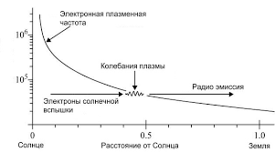

#Элементарные определения физики плазмы. 

**Плазмой** называется состояние вещества при котором в веществе присутствуют свободные электроны, положительно заряженные атомы или ионы и нейтральные атомы или молекулы. В простейшем случае плазму можно представить как ионизованный газ. 
В зависимости от степени ионизации атомов условно плазму делят на холодную и горячую. Холодная плазма - это состояние ионизованного газа при котором число положительно заряженных ионов незначительно. Очевидно, что для отрыва большого числа электронов от многоэлектронного атома требуется приложить большое количество энергии. В этом смысле сильно ионизованную плазму можно называть горячей. 
**Плазма** - наиболее распространенное состояние вещества в природе. Звезды - это гигантские области горячей, то есть сильно ионизованной плазмы. Внешняя поверхность земной атмосферы окружена плазменной оболочкой, которая называется ионосферой. Плазма возникает при любых типах газовых разрядов (молния, искра, электрическая дуга и т.п.). Электрические силы, связывая разноименные заряды в плазме обеспечивают квазинейтральность плазмы. Разделение положительных и отрицательных зарядов в объеме плазмы приводит к возникновению электрических полей, стремящихся восстановить равновесное распределение зарядов. Для того, чтобы оценить напряженность поля, которая может возникать при нарушении нейтральности плазмы, предположим, что в некотором объеме имеющем характерные линейные размеры x, произошло полное разделение положительных и отрицательных зарядов. 
Электрическое поле в данной области удовлетворяет уравнению:
$div E ≈ E/x = 4πρ = 4π n e.$
Здесь $n$ число электронов в единице объема, e - заряд электрона. Таким образом величина поля, возникающего в пространстве при разделении зарядов в области с размерами x имеет следующий порядок величины:
$E ≈ 4π n e x$.
Потенциал плазмы в области разделения зарядов по порядку величины будет равен:
$ϕ ≈ E x = 4π n e x^2$
#### Плазменная частота. 
Очевидно, что заряды плазмы одновременно входят в состав экранирующего объема и сами являются пробными зарядами. Это означает, что области неоднородности плазмы постоянно возникают и разрушаются по объему плазмы. Время, в течении которого области неоднородности существуют, можно оценить, разделив δ на скорость движения более быстрых электронов.

#### Высокочастотное поле в плазме.
Своеобразие свойств плазмы проявляется существенно под действием высокочастотного электрического поля. Рассмотрим в качестве примера простейший случай. Пусть в плазме имеется переменное электрическое поле с напряженностью $E = E0 exp(i ω t)$. Комплексная форма используется только для упрощения промежуточных вычислений. Если частота поля столь велика, что за время $t ≈ 1/ω$ вероятность столкновения электрона с ионами ничтожно мала, то можно рассматривать движение электрона пренебрегая столкновениями
